<!--
*** Thanks for checking out the Best-README-Template. If you have a suggestion
*** that would make this better, please fork the repo and create a pull request
*** or simply open an issue with the tag "enhancement".
*** Thanks again! Now go create something AMAZING! :D
***
-->

<!-- PROJECT SHIELDS -->
<!--
*** I'm using markdown "reference style" links for readability.
*** Reference links are enclosed in brackets [ ] instead of parentheses ( ).
*** See the bottom of this document for the declaration of the reference variables
*** for contributors-url, forks-url, etc. This is an optional, concise syntax you may use.
*** https://www.markdownguide.org/basic-syntax/#reference-style-links
-->
<!-- [![Contributors][contributors-shield]][contributors-url]
[![Forks][forks-shield]][forks-url]
[![Stargazers][stars-shield]][stars-url]
[![Issues][issues-shield]][issues-url]
[![MIT License][license-shield]][license-url]
[![LinkedIn][linkedin-shield]][linkedin-url] -->

<!-- PROJECT LOGO -->
 

  

  <h3 align="center">Resume Creator</h3>

  

    A React based Resume creator utilizing Material UI.
     
    <a href="https://github.com/craigmclean39/cv-project-top"><strong>Explore the docs »</strong></a>
     
     
    <a href="https://craigmclean39.github.io/cv-project-top/">View Demo</a>
    ·
    <a href="https://github.com/craigmclean39/cv-project-top/issues">Report Bug</a>
    ·
    <a href="https://github.com/craigmclean39/cv-project-top/issues">Request Feature</a>
  

<!-- TABLE OF CONTENTS -->

  
<h2 style="display: inline-block">Table of Contents</h2>

  <ol>
    <li>
      <a href="#about-the-project">About The Project</a>
      <ul>
        <li><a href="#built-with">Built With</a></li>
        <li><a href="#libraries-used">Libraries Used</a></li>
      </ul>
    </li>
    <li>
      <a href="#getting-started">Getting Started</a>
    </li>
    <li><a href="#features">Features</a></li>
    <li><a href="#contact">Contact</a></li>
    <li><a href="#acknowledgements">Acknowledgements</a></li>
  </ol>

<!-- ABOUT THE PROJECT -->

## About The Project

  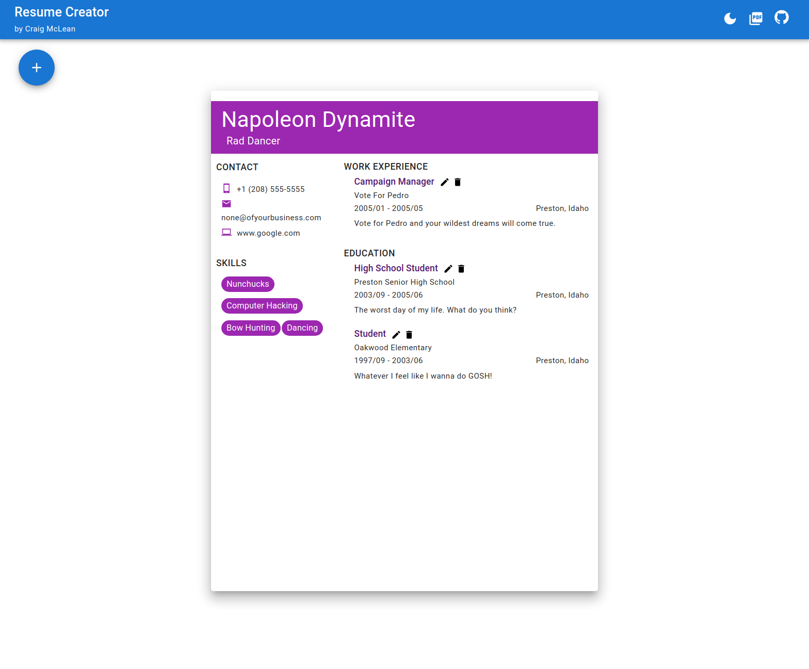 

This is a refactor of my first React project created for The Odin Project Full Stack JavaScript curriculum. Initially the project was created with class base components and setState. I've refactored it to use exclusively functional components and hooks. I've created a custom hook, useResume, to handle the loading and editing of the resume. The Resume is stored with the useReducer hook, which is then returned from this useResume hook and updated through the dispatch function. I've also used the latest version of Material UI, v5. I used Dialogs, TextFields, a SpeedDial menu, as well as Buttons, Boxes, Typography, and a host of other components. I also utilized the ThemeProvider system to theme the app in a light and dark mode as well as for setting colors on the resume and providing responsive font sizes.

### Built With

- [JavaScript](https://developer.mozilla.org/en-US/docs/Web/JavaScript)
- [React](https://reactjs.org/)
- [MUI v5](https://mui.com/)

### Libraries Used

- [Uniqid](https://www.npmjs.com/package/uniqid)
- [date-fns](https://date-fns.org/)
- [email-validator](https://www.npmjs.com/package/email-validator)
- [html2canvas](https://html2canvas.hertzen.com/)
- [jsPDF](https://www.npmjs.com/package/jspdf)

<!-- GETTING STARTED -->

## Getting Started

Take a look at the demo <a href="https://craigmclean39.github.io/cv-project-top/">here.</a>

<!-- USAGE EXAMPLES -->

## Features

Resume Creator has the following features:

- Desktop and mobile support.

  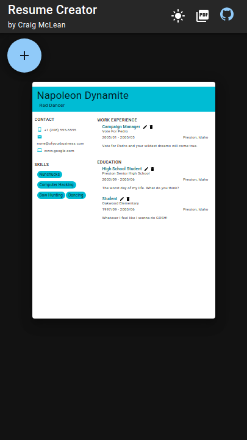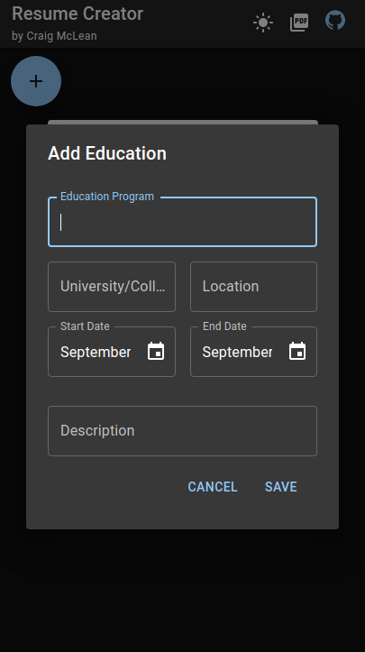

- The user can access a SpeedDial menu to access the options

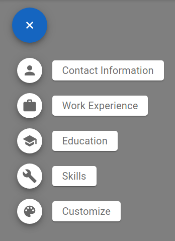

- Add/edit contact details

  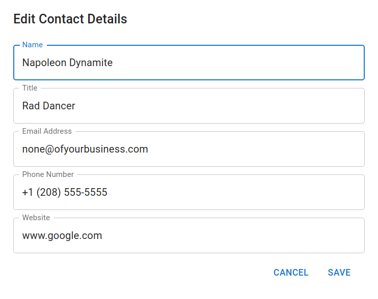

- Add work history

  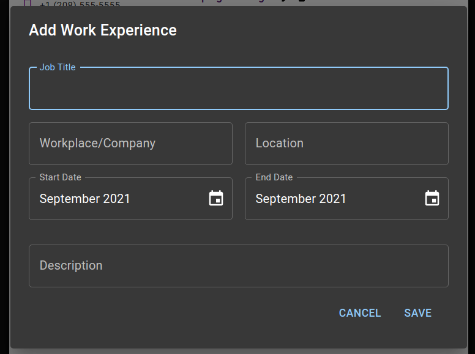

- Add education history

  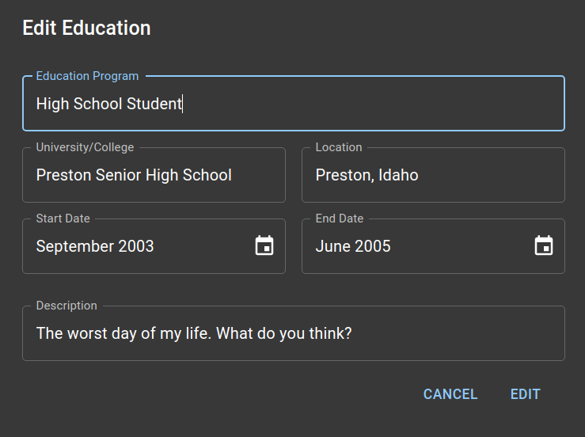

- Add/delete skills

  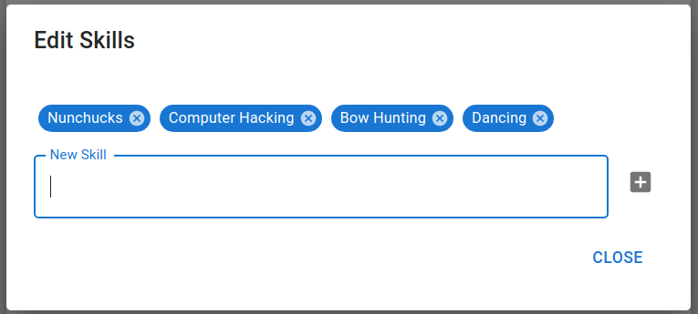

- Customize the color palette of the resume

  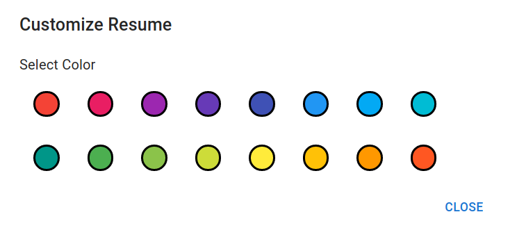 
  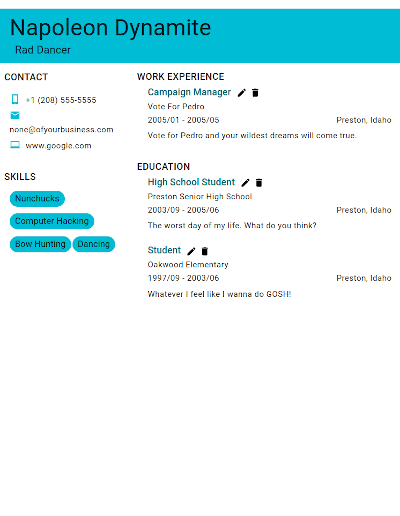
  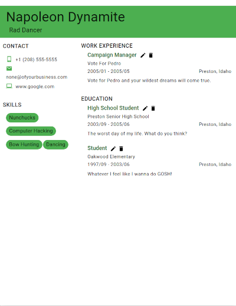

- Editing and Deleting of work/education information is handled with buttons on the generated resume itself.

  

- The site supports a dark and light mode

  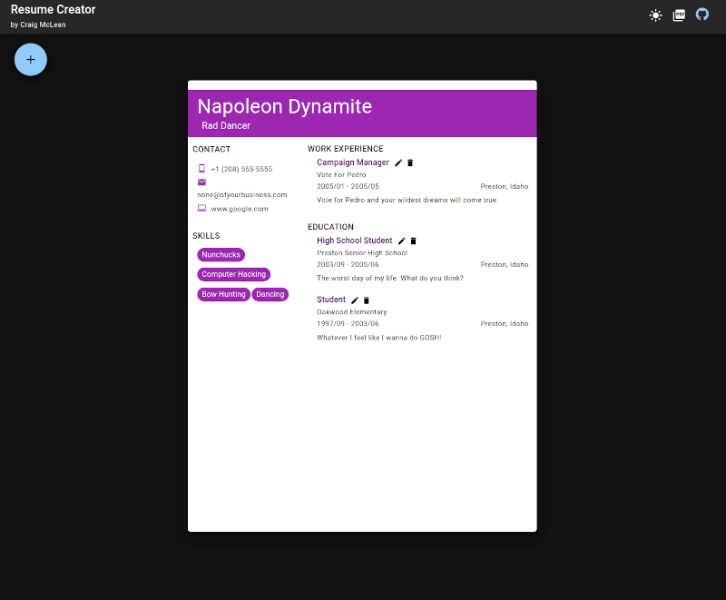
  

- The resume can be exported as a pdf

   
  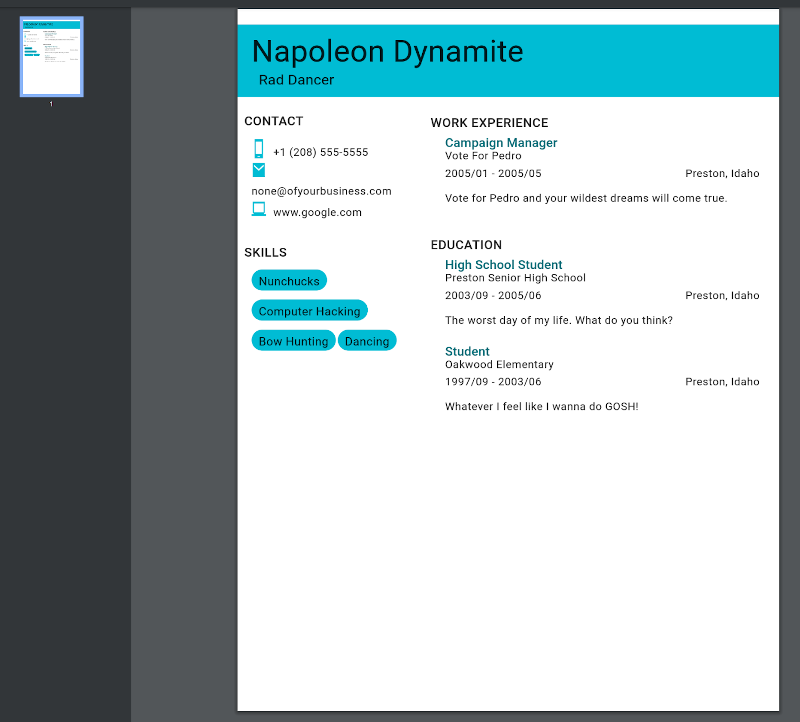

- The resume, as well as dark/light mode preference is saved in localStorage

<!-- CONTACT -->

## Contact

Craig McLean - craig@craigmclean.dev

Project Link: [https://github.com/craigmclean39/cv-project-top](https://github.com/craigmclean39/cv-project-top)

<!-- ACKNOWLEDGEMENTS -->

## Acknowledgements

- [The Odin Project](https://www.theodinproject.com/)
- [Google Fonts](https://fonts.google.com/)
